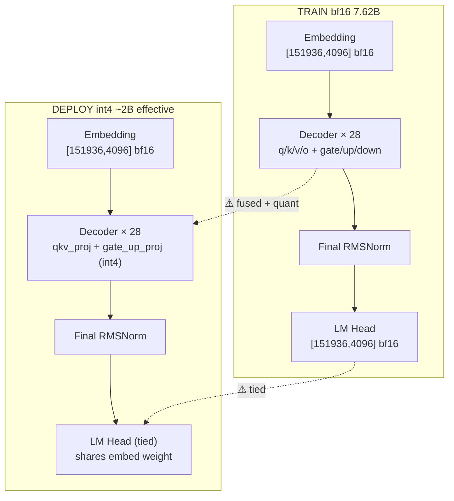

# Model Viewer 产品需求文档（PRD）

> **项目代号**：`model-viewer`（CLI 工具名建议：`mad` = model-arch-diff）
>
> **目标用户**：模型训练团队、模型部署团队、算法/工程跨团队评审人
>
> **核心问题**：训练团队和部署团队需要对齐模型的结构、命名、量化方式、显存开销，但目前缺少一个**精确、可视化、可 diff、可对账**的工具。
>
> **文档版本**：v0.1
>
> **创建日期**：2026-05-07

---

## 一、背景与动机

### 1.1 当前痛点

模型从训练交付到推理部署的链路中，训练侧（HuggingFace / Megatron / Swift / DeepSpeed）和部署侧（vLLM / TensorRT-LLM / SGLang）在以下维度经常出现"对不上"的问题：

| 维度 | 典型问题示例 |
|---|---|
| **权重命名** | `q_proj/k_proj/v_proj` ↔ `qkv_proj`（fused）；`gate_proj+up_proj` ↔ `gate_up_proj` |
| **数据精度** | 训练侧 bf16，部署侧 int4/int8/fp8 量化，但缺少端到端校验 |
| **结构差异** | tied embedding、lm_head 缺失、RoPE scaling、混合注意力（DeltaNet/线性）层位置 |
| **辅助张量** | 量化产生的 `*.scales / *.zeros / *.g_idx` 与主 weight 的关联关系 |
| **MoE 拓扑** | 专家数、激活专家数、shared expert、router 是否可训练 |
| **显存对账** | 训练侧 `model_weights + grads + optimizer + activations`；部署侧 `weights + KV cache + prefill peak` |

这些问题靠"看 config.json"或"对脚本"无法系统化解决，需要一个**自动化的可视化与 diff 工具**。

### 1.2 既有资产

- **`training-resource-estimator`**（`/Users/cgs/Documents/project/training-resource-estimator/`）：已经实现了从 HF / ModelScope / 本地 config 解析模型结构、估算训练/推理显存的能力。本工具应**直接复用其解析层和估算层**，避免重复造轮子。
- **`dashscope-finetune` 闭源模型上架**：训练-部署协作场景的一线需求源（参见 `closed-source-model-onboarding-collaboration.md`），本工具应能服务于此类多方协作的对账场景。

---

## 二、产品目标

### 2.1 北极星指标

> **让任何一对模型（训练态 / 部署态 / 不同版本 / 不同量化方案）的结构差异，能在 30 秒内被一张图说清楚。**

### 2.2 核心目标

1. **精确表达**：用字符图 + 折叠语法精确描述模型的每一层、每一个 tensor 的 shape、dtype、参数量
2. **直观可视**：用结构图（Mermaid / SVG / ASCII block）让非算法同学也能快速建立模型直觉
3. **多维 diff**：从结构、命名、参数量、显存占用四个维度对两个模型做 diff
4. **跨团队协作**：输出格式覆盖终端、Markdown（贴语雀/钉钉文档）、HTML（交互式）、JSON（CI 消费）

### 2.3 非目标（明确不做的事）

- 不做模型权重数值比较（不验证训练是否收敛、不做精度回归）
- 不做模型推理性能 benchmark（吞吐、TTFT、TPOT 由其他工具负责）
- 不做模型结构修改、转换（不做 checkpoint converter 的活）

---

## 三、用户场景（User Stories）

### 场景 1：闭源模型上架对齐（核心场景）

> 算法团队交付了 4 套权重（LLM-Inst / LLM-Think / VL-Inst / VL-Think），训练脚本团队、训练功能团队、部署功能团队需要对齐：每套权重的结构、命名、参数量、量化方案是否符合上架协议。

**期望使用方式**：

```bash
mad show /cpfs/model/qwen3.6-plus-llm-instruct --view all -o llm-instruct.md
mad diff /cpfs/model/qwen3.6-plus-llm-instruct \
         /cpfs/model/qwen3.6-plus-llm-thinking \
         --view structure,naming -o inst-vs-think.md
```

### 场景 2：训练态 vs 部署态对账

> 训练完成后产出 bf16 权重，部署侧做了 GPTQ int4 量化 + qkv fuse，需要确认部署态权重是否完整覆盖训练态的所有功能 tensor。

```bash
mad diff /train/output/qwen-7b-bf16 \
         /deploy/quantized/qwen-7b-gptq-int4 \
         --view all --fuzzy-match -o train-vs-deploy.md
```

### 场景 3：版本回归

> 模型迭代到下一版本，需要确认结构变更范围（用于 PR review、用于通知下游适配）。

```bash
mad snapshot /model/qwen3.6-v1 -o qwen3.6-v1.snapshot.json
# ... 一段时间后
mad diff qwen3.6-v1.snapshot.json /model/qwen3.6-v2 --view structure
```

### 场景 4：架构图嵌入设计文档

> 写设计评审文档时，需要把模型结构图直接贴进语雀 / 钉钉文档。

```bash
mad show /model/qwen3.6-plus --view overview --format mermaid > arch.mmd
mad show /model/qwen3.6-plus --view detail --layer 0 --format svg > layer0.svg
```

### 场景 5：CI 卡点

> PR 修改了模型结构（如新增/删除 layer、改 shape），CI 自动 diff 并要求人工 review。

```bash
mad diff baseline.snapshot.json /model/current --view structure --format json --fail-on-change
```

---

## 四、功能设计

### 4.1 输入支持

| 输入类型 | 示例 | 说明 |
|---|---|---|
| **本地模型目录** | `/path/to/model_dir/` | 包含 `config.json` + `*.safetensors` + `*.safetensors.index.json` |
| **safetensors index** | `/path/to/model.safetensors.index.json` | 仅读 metadata，不加载权重，速度快 |
| **HuggingFace ID** | `Qwen/Qwen3.5-7B-Instruct` 或 `hf://...` | 通过 `huggingface_hub` 拉取 |
| **ModelScope ID** | `AI-ModelScope/Qwen2.5-7B` 或 `ms://...` | 通过 `modelscope` 拉取 |
| **HF state_dict pickle** | `/path/to/pytorch_model.bin` | 兼容老格式 |
| **快照 JSON** | `qwen.snapshot.json` | 由 `mad snapshot` 导出，离线 diff 用 |
| **vLLM weight loader 注册表** | （扩展能力） | 对接部署侧实际加载的 key 集合 |

### 4.2 输出视图（六视图）

#### 视图 1：Overview（结构图，Mermaid 框图）

> **用途**：贴 PRD / 设计文档，给非算法同学快速建立直觉



#### 视图 2：Heatmap（差异热力图）

> **用途**：一眼看出 28+ 层中哪些层、哪些模块有差异

```text
                   embed  ln1  q_proj  k_proj  v_proj  o_proj  ln2  gate  up  down  Σ
        layer 0    ░░░░   ░░░  ▓▓▓▓   ▓▓▓▓   ▓▓▓▓   ▓▓▓▓   ░░░  ▓▓▓  ▓▓▓ ▓▓▓   ⚠
        layer 1    ░░░░   ░░░  ▓▓▓▓   ▓▓▓▓   ▓▓▓▓   ▓▓▓▓   ░░░  ▓▓▓  ▓▓▓ ▓▓▓   ⚠
        layer 2~26 ░░░░   ░░░  ▓▓▓▓   ▓▓▓▓   ▓▓▓▓   ▓▓▓▓   ░░░  ▓▓▓  ▓▓▓ ▓▓▓   ⚠ (折叠)
        layer 27   ░░░░   ░░░  ▓▓▓▓   ▓▓▓▓   ▓▓▓▓   ▓▓▓▓   ░░░  ▓▓▓  ▓▓▓ ▓▓▓   🔴 多了 post_norm
        lm_head    🔴                                                            🔴 deploy tied

  图例：░ 完全一致    ▓ 等价但 dtype/fuse 不同    🔴 真差异
```

颜色编码（终端 ANSI 256 / HTML 背景色）：

- 🟢 `░` 完全一致
- 🟡 `▓` 等价但有差异（量化、fuse、tied）
- 🔴 单元 真缺失 / 真新增 / shape 不一致
- 🔵 `↻` 重命名（基于 fuzzy 匹配）

#### 视图 3：Layer Detail（单层放大镜，含数据流）

> **用途**：异构层逐层放大，看清 tensor 形状、算子、激活值大小

```text
                      DECODER BLOCK (单层放大)
                           hidden = 4096
                                │
                          ┌─────▼─────┐
                          │ RMSNorm   │   activation: B×T×4096
                          └─────┬─────┘
              ┌─────────────────┼─────────────────┐
              │                 │                 │
        ┌─────▼─────┐     ┌─────▼─────┐     ┌─────▼─────┐
        │ q_proj    │     │ k_proj    │     │ v_proj    │
        │[4096,4096]│     │[4096, 512]│     │[4096, 512]│   ◄── GQA: kv 头数 4
        │   bf16    │     │   bf16    │     │   bf16    │
        └─────┬─────┘     └─────┬─────┘     └─────┬─────┘
              │                 │                 │
              └────────┬────────┴────────┬────────┘
                       ▼                 ▼
                  ┌────────┐        ┌─────────┐
                  │  RoPE  │        │ KV Cache│  ◄── deploy 侧才有
                  └───┬────┘        └────┬────┘     [B, T, 4, 128] × layers
                      └────────┬─────────┘
                               ▼
                       ┌──────────────┐
                       │ Flash-Attn   │   activation: B×H×T×T (无, flash)
                       └──────┬───────┘
                              ▼
                       ┌──────────────┐
                       │ o_proj       │
                       │ [4096, 4096] │
                       └──────┬───────┘
                              ▼  + residual
                       ┌──────────────┐
                       │ RMSNorm      │
                       └──────┬───────┘
            ┌─────────────────┼─────────────────┐
            ▼                 ▼                 ▼
      ┌──────────┐     ┌──────────┐
      │gate_proj │     │ up_proj  │
      │[4096,    │     │[4096,    │
      │  11008]  │     │  11008]  │
      └────┬─────┘     └────┬─────┘
           │                │
           └───→ SiLU ⊙ ────┘
                    │
              ┌─────▼─────┐
              │down_proj  │
              │[11008,    │
              │   4096]   │
              └─────┬─────┘
                    ▼  + residual → 下一层
```

#### 视图 4：Key Mapping（命名映射表）

> **用途**：解决训练侧 / 部署侧命名不一致的对账难题

```text
TRAIN key                                       DEPLOY key                                MATCH
model.embed_tokens.weight                       model.embed_tokens.weight                 ✓ exact
model.layers.0.self_attn.q_proj.weight     ┐
model.layers.0.self_attn.k_proj.weight     ├─→ model.layers.0.self_attn.qkv_proj.weight  ↻ fused (q+k+v)
model.layers.0.self_attn.v_proj.weight     ┘
model.layers.0.self_attn.o_proj.weight          model.layers.0.self_attn.o_proj.weight    ✓ exact
model.layers.0.mlp.gate_proj.weight        ┐
model.layers.0.mlp.up_proj.weight          ├─→ model.layers.0.mlp.gate_up_proj.weight    ↻ fused (gate+up)
model.layers.0.mlp.down_proj.weight             model.layers.0.mlp.down_proj.weight       ✓ exact
                                                model.layers.0.self_attn.qkv_proj.scales  ⚠ deploy-only (quant)
                                                model.layers.0.self_attn.qkv_proj.zeros   ⚠ deploy-only (quant)
                                                model.layers.0.self_attn.qkv_proj.g_idx   ⚠ deploy-only (quant)
lm_head.weight                                  (tied with embed_tokens)                  ↻ tied
```

#### 视图 5：Memory Footprint（显存对比，融合 memory-estimate）

> **用途**：跨团队对账"为什么部署侧需要 X GB 显存"
>
> **依赖**：复用 `training-resource-estimator` 的估算公式

```text
                                     [TRAIN bf16]      [DEPLOY int4]      [Δ]
  ┌────────────────────────────────────────────────────────────────────────────┐
  │ Embedding          ▓▓▓▓▓▓▓▓▓▓░░░░░░░░  1.18 GB  →  ▓▓▓▓▓▓▓▓▓▓ 1.18 GB   ✓ │
  │ Decoder × 28                                                                │
  │   ├ Attention QKVO ▓▓▓▓▓▓▓░░░░░░░░░░░  1.96 GB  →  ▓░         0.49 GB  -75%│
  │   ├ MLP gate/up    ▓▓▓▓▓▓▓▓▓▓▓▓░░░░░░  4.83 GB  →  ▓▓▓        1.21 GB  -75%│
  │   ├ MLP down       ▓▓▓▓▓▓▓░░░░░░░░░░░  2.41 GB  →  ▓▓         0.60 GB  -75%│
  │   └ LayerNorms     ░                  0.001 GB  →  ░         0.001 GB  ✓   │
  │ KV Cache (推理)    ✗ N/A                          ▓▓▓▓▓▓▓   ~3.2 GB   新增│
  │ LM Head            ▓▓▓▓▓▓▓▓▓▓░░░░░░░░  1.18 GB  →  (tied)        0 GB  -100%│
  ├────────────────────────────────────────────────────────────────────────────┤
  │ TOTAL              ▓▓▓▓▓▓▓▓▓▓▓▓▓▓▓▓▓▓ 14.2 GB  →  ▓▓▓▓▓▓▓▓   6.8 GB  -52%│
  └────────────────────────────────────────────────────────────────────────────┘
```

#### 视图 6：Raw Tree（精确字符树，含折叠）

> **用途**：精确对账每个 tensor，CI 消费首选

```text
Qwen2ForCausalLM  [7.62B params, bf16]
├── model.embed_tokens                    [151936, 4096]  bf16   622M
├── model.layers.[0..27] × 28  ◄── 折叠
│   ├── self_attn
│   │   ├── q_proj                [4096, 4096]   bf16   16.8M
│   │   ├── k_proj                [4096, 512]    bf16    2.1M  ◄── GQA
│   │   ├── v_proj                [4096, 512]    bf16    2.1M
│   │   ├── o_proj                [4096, 4096]   bf16   16.8M
│   │   └── rotary_emb            (no params)
│   ├── mlp
│   │   ├── gate_proj             [4096, 11008]  bf16   45.1M
│   │   ├── up_proj               [4096, 11008]  bf16   45.1M
│   │   └── down_proj             [11008, 4096]  bf16   45.1M
│   ├── input_layernorm           [4096]         bf16    4.1K
│   └── post_attention_layernorm  [4096]         bf16    4.1K
├── model.norm                    [4096]         bf16    4.1K
└── lm_head                       [151936, 4096] bf16    622M  ◄── tied? 见标记
```

### 4.3 折叠语法

| 折叠语法 | 含义 | 触发条件 |
|---|---|---|
| `layers.[0..27] × 28` | 连续编号的同构块 | 子树结构、shape 完全一致 |
| `experts.[0..7] × 8 (MoE)` | MoE 专家组 | 命名含 expert 且结构一致 |
| `layers.[0..3, 28..31] × 8` | 不连续但同构 | 混合精度场景部分层异构 |
| `layers.[0..27] × 28 ⚠ (3 异构)` | 大部分同构、少数异构 | 有少数层 shape 不同时高亮 |
| `layers.[A][0..15] [L][16..31]` | 标注层类型 | 混合注意力（A=Attn, L=Linear/DeltaNet）|

**展开方式**：

- CLI：`--expand "layers.0"` 或 `--expand "layers.[0,15,27]"`
- TUI：`textual` 或 `rich.tree` 交互式，按空格展开

### 4.4 Diff 维度

| 维度 | 描述 | 输出形态 |
|---|---|---|
| **A. 结构 diff** | 树形对齐，逐 key 比对 shape / dtype / 存在性 | 视图 6（带 `→` 与状态符号）|
| **B. 命名映射** | 检测 fused / tied / rename，建立 train→deploy 映射 | 视图 4 |
| **C. 参数量汇总** | total params / 内存占用 / layer 数 / vocab / tied | 表格 |
| **D. 异构层定位** | 折叠态下高亮哪些层不一致 | 视图 2 + 视图 3 |
| **E. 显存对比** | 复用 memory-estimator，按组件分项对比 | 视图 5 |

### 4.5 Fuzzy 匹配引擎

自动建立 train ↔ deploy 的 key 映射，处理以下变换：

1. **Fuse 检测**：`q_proj + k_proj + v_proj` ↔ `qkv_proj`（基于 shape 总和 + 命名子串）
2. **Tied 检测**：`lm_head.weight` 和 `embed_tokens.weight` 是否共享存储
3. **Rename 检测**：基于 shape 完全相同 + 命名编辑距离阈值
4. **量化伴生张量**：`*.scales / *.zeros / *.g_idx / *.qweight` 自动归属到对应主 weight

### 4.6 量化感知

识别以下量化方案的辅助 tensor，diff 时关联展示而非当独立 key：

- **GPTQ**：`qweight / qzeros / scales / g_idx`
- **AWQ**：`qweight / qzeros / scales`
- **SmoothQuant**：`act_scales / weight_scales`
- **fp8**：`weight_scale_inv`
- **LoRA adapter**：`lora_A / lora_B`

### 4.7 MoE 专属处理

- 专家组折叠：`experts.[0..7] × 8 ⓟ shared+EP`
- 显存视图单独拆出：`Expert Weights / Router Logits / Shared Expert / Router (trainable?)` 四项
- 支持 `vllm_enable_expert_parallel` 模式下的分片估算

### 4.8 混合注意力（DeltaNet / 线性注意力）

- 用 `[A]`（标准 Attention）/ `[L]`（Linear/DeltaNet）标记每一层类型
- diff 时高亮 `num_kv_cache_layers` 的差值
- 显存视图按 memory-estimate 文档的 `State_Cache` 公式单独估算线性注意力开销

---

## 五、CLI 设计

### 5.1 命令总览

```bash
# 展示单个模型结构（默认折叠态）
mad show <model_path_or_id> [--view all|overview|tree|heatmap|memory|...]

# 展开指定层
mad show <model> --expand "layers.0"

# 两个模型 diff
mad diff <model_a> <model_b> [--view all|structure|naming|params|heterogeneous|memory]

# 生成 baseline 快照（仅 metadata，不含权重数值）
mad snapshot <model> -o snapshot.json

# 对快照 diff（无需加载权重）
mad diff <snapshot_a.json> <snapshot_b.json>

# 显存估算（直接调 training-resource-estimator）
mad memory <model> [--mode train|deploy] [--params ...]
```

### 5.2 通用参数

| 参数 | 取值 | 说明 |
|---|---|---|
| `--format` | `term` (默认) / `markdown` / `mermaid` / `svg` / `html` / `json` | 输出格式 |
| `-o, --output` | 文件路径 | 输出到文件，否则到 stdout |
| `--view` | `all` / 视图名（可逗号分隔） | 选择视图组合 |
| `--collapse` / `--no-collapse` | bool | 是否折叠同构层 |
| `--expand` | `layers.0` / `experts.[0,3]` 等 | 强制展开指定路径 |
| `--fuzzy-match` / `--exact-match` | bool | 是否启用 fuzzy 命名匹配 |
| `--fail-on-change` | bool | CI 模式：发现差异时退出码非 0 |
| `--model-source` | `auto` / `hf` / `ms` / `local` | 模型源 |

### 5.3 输出格式联动

| Format | 适用场景 |
|---|---|
| `term` | 命令行交互、日常使用 |
| `markdown` | 嵌入语雀 / 钉钉 / GitHub 文档 |
| `mermaid` | 嵌入支持 mermaid 渲染的文档（建议优先）|
| `svg` | 嵌入 PPT / 评审材料 |
| `html` | 自带交互（点击层展开/折叠、热力图 hover）|
| `json` | CI 消费、程序处理、快照存档 |

---

## 六、技术架构

### 6.1 模块划分

```text
model-viewer/
├── parser/                # 输入解析层
│   ├── safetensors_parser.py     # 读 .safetensors / .index.json，仅取 metadata
│   ├── hf_config_parser.py       # 读 config.json
│   ├── hf_remote_loader.py       # 通过 huggingface_hub 拉取 metadata
│   ├── ms_remote_loader.py       # 通过 modelscope 拉取 metadata
│   ├── snapshot_loader.py        # 读 mad 快照 JSON
│   └── vllm_registry_parser.py   # （扩展）读 vLLM 内部 weight loader 注册表
│
├── model/                 # 内部模型表示
│   ├── tensor_meta.py            # TensorMeta(name, shape, dtype, num_params, hash)
│   ├── module_node.py            # ModuleNode(name, children, tensors)
│   └── model_arch.py             # ModelArch(root, total_params, dtype, ...)
│
├── analyzer/              # 分析层
│   ├── collapser.py              # 折叠同构层 → 折叠语法
│   ├── fuzzy_matcher.py          # train↔deploy key fuzzy 匹配
│   ├── quant_detector.py         # 识别 GPTQ/AWQ/fp8/LoRA 等
│   ├── tied_detector.py          # 检测 tied weights
│   └── moe_detector.py           # 识别 MoE 专家组
│
├── differ/                # Diff 层
│   ├── structure_differ.py       # 维度 A
│   ├── naming_differ.py          # 维度 B
│   ├── params_differ.py          # 维度 C
│   ├── heterogeneity_differ.py   # 维度 D
│   └── memory_differ.py          # 维度 E（调 estimator）
│
├── renderer/              # 渲染层
│   ├── tree_renderer.py          # 视图 6
│   ├── heatmap_renderer.py       # 视图 2
│   ├── layer_detail_renderer.py  # 视图 3
│   ├── mermaid_renderer.py       # 视图 1
│   ├── memory_renderer.py        # 视图 5
│   └── mapping_renderer.py       # 视图 4
│
├── exporter/              # 输出格式
│   ├── term_exporter.py          # ANSI 终端
│   ├── markdown_exporter.py
│   ├── mermaid_exporter.py
│   ├── svg_exporter.py
│   ├── html_exporter.py
│   └── json_exporter.py
│
├── integrations/          # 外部集成
│   └── memory_estimator.py       # 调用 training-resource-estimator
│
├── cli/
│   └── mad.py                    # CLI 入口
│
├── tests/
└── pyproject.toml
```

### 6.2 与 training-resource-estimator 的集成

**复用方式**：作为 Python 包 import，**不通过 subprocess 调用**。

需要从 estimator 借用的能力：

| 能力 | estimator 中的位置（推测）|
|---|---|
| 解析 HF/MS config，获取 `hidden_size / num_layers / intermediate_size / vocab / num_attention_heads / num_key_value_heads / num_experts ...` | `memory_estimation/model_config_loader.py` 等 |
| 估算 `model_weights_gib / activations_gib / kv_cache_gib / state_cache_gib / prefill_activation_peak / runtime_buffer` | `memory_estimation/estimate_*_vram.py` |
| MoE 专家分片、`vllm_enable_expert_parallel` 处理 | 同上 |
| 量化方案影响 weight bytes 的换算 | 同上 |

**集成约定**：

- estimator 必须以 Python 包形式可导入（必要时帮助其规范化为 `pip install -e .`）
- model-viewer 不重复实现公式，仅在 estimator 不支持新维度时提交反向 PR

### 6.3 数据模型（关键 schema）

```python
@dataclass
class TensorMeta:
    name: str                  # "model.layers.0.self_attn.q_proj.weight"
    shape: tuple[int, ...]     # (4096, 4096)
    dtype: str                 # "bf16" / "int4" / ...
    num_params: int
    storage_offset: int | None # safetensors 中的偏移
    is_quantized: bool
    quant_scheme: str | None   # "gptq" / "awq" / "fp8" / None
    aux_tensors: list[str]     # ["...scales", "...zeros", "...g_idx"]
    is_tied_with: str | None   # 若是 tied，指向源 tensor name

@dataclass
class ModuleNode:
    name: str                  # "model.layers.0.self_attn"
    type_hint: str             # "SelfAttention" / "MLP" / "RMSNorm" / ...
    children: list["ModuleNode"]
    tensors: list[TensorMeta]
    repeat_signature: str | None   # 用于折叠检测的"指纹"

@dataclass
class ModelArch:
    name: str                  # "Qwen2ForCausalLM"
    total_params: int
    primary_dtype: str
    config: dict               # 原始 HF config
    root: ModuleNode
    largest_tensor: TensorMeta
    extras: dict               # MoE / 混合注意力等元信息
```

### 6.4 性能要求

| 操作 | SLA |
|---|---|
| 解析单模型 metadata（不读权重数值） | < 3s（本地）/ < 30s（远程拉取）|
| 渲染所有视图 | < 2s |
| 单模型 → snapshot.json | < 5s |
| snapshot ↔ snapshot diff | < 1s |
| 大模型（70B+ / 60+ 层）渲染 | < 5s |

---

## 七、里程碑与交付计划

### M1：MVP（2 周）

- [ ] safetensors index + config.json 解析
- [ ] 视图 6（Raw Tree）+ 视图 2（Heatmap）
- [ ] 折叠语法基础版（连续编号 + 完全同构）
- [ ] CLI：`mad show` / `mad diff` / `mad snapshot`
- [ ] 输出：`term` / `markdown` / `json`

### M2：跨团队对账增强（2 周）

- [ ] 视图 4（Key Mapping）+ Fuzzy 匹配引擎
- [ ] 量化感知（GPTQ / AWQ / fp8）
- [ ] Tied weights 检测
- [ ] 视图 1（Mermaid Overview）

### M3：显存联动（1 周）

- [ ] 与 training-resource-estimator 集成
- [ ] 视图 5（Memory Footprint）
- [ ] 视图 3（Layer Detail）

### M4：扩展能力（按需）

- [ ] HF / ModelScope 远程拉取
- [ ] MoE 专属处理
- [ ] 混合注意力（DeltaNet）支持
- [ ] HTML 交互式输出
- [ ] CI 卡点模式（`--fail-on-change`）
- [ ] vLLM weight loader 注册表对接

---

## 八、风险与开放问题

### 8.1 已识别风险

| 风险 | 缓解策略 |
|---|---|
| 不同推理引擎（vLLM / TRT-LLM / SGLang）的内部命名差异大 | 优先支持 vLLM；其他引擎通过 plugin 机制扩展 |
| 部署侧权重通常不会保留原始命名（已 fuse / 已量化） | 仅依赖 fuzzy 匹配 + shape 反推，必要时人工提供 mapping rule |
| training-resource-estimator 当前不一定以 Python 包形式可导入 | M3 阶段先反向 PR estimator，规范化包结构 |
| 大模型 metadata 仍可能很大（70B+ MoE 专家上千个 tensor）| 折叠优先 + 流式处理 + 抽样渲染 |
| 闭源模型权重路径在 CPFS 上，本工具运行环境需有读权限 | 部署到 DSW / 训练节点；快照模式可异地 diff |

### 8.2 开放问题（需评审决策）

1. **是否做 Web UI？** 当前 PRD 以 CLI + 静态导出为主；交互式探索建议 M4 用 HTML 单文件版（不引入前端工程）
2. **是否对账权重数值？** 当前 PRD 明确不做；如有需求可单独立项做 `mad verify`
3. **跨多模型批量 diff（N 个模型矩阵化）？** 不在本期范围；可作为脚本组合调用 `mad diff` 实现
4. **是否纳入 dashscope-finetune 上架流程？** 建议作为后续与训练功能侧、部署功能侧的协作话题

---

## 九、附录

### 9.1 参考资料

- 训练资源估算工具：`/Users/cgs/Documents/project/training-resource-estimator/docs/swift/deepspeed/on-policy-memory-estimate.md`
- 闭源模型上架协作：`/Users/cgs/Documents/project/dashscope/dashscope-finetune/docs/closed-source-model-onboarding-collaboration.md`

### 9.2 术语表

| 术语 | 含义 |
|---|---|
| **GQA** | Grouped Query Attention，KV 头数少于 Q 头数 |
| **MoE** | Mixture of Experts |
| **Tied weights** | embedding 与 lm_head 共享权重 |
| **Fused weights** | q/k/v 或 gate/up 合并存储为单个 tensor |
| **State Cache** | DeltaNet / 线性注意力的 RNN 块级隐状态缓存 |
| **Prefill Peak** | 长上下文首 token 预填充阶段的瞬时激活峰值 |
