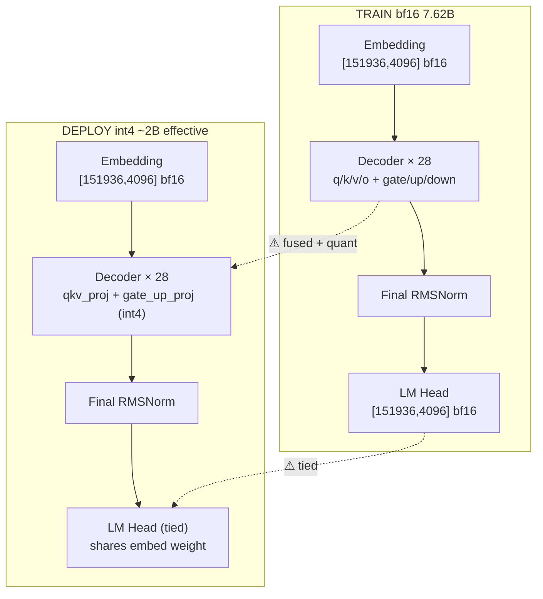

# Model Viewer 视图范例集

> 本文档抽取了 PRD 中的核心视图范例，方便贴入设计文档、PPT、评审材料时直接复用。

## 范例 1：Overview（Mermaid 框图）



## 范例 2：Heatmap（差异热力图）

```text
                   embed  ln1  q_proj  k_proj  v_proj  o_proj  ln2  gate  up  down  Σ
        layer 0    ░░░░   ░░░  ▓▓▓▓   ▓▓▓▓   ▓▓▓▓   ▓▓▓▓   ░░░  ▓▓▓  ▓▓▓ ▓▓▓   ⚠
        layer 1    ░░░░   ░░░  ▓▓▓▓   ▓▓▓▓   ▓▓▓▓   ▓▓▓▓   ░░░  ▓▓▓  ▓▓▓ ▓▓▓   ⚠
        layer 2~26 ░░░░   ░░░  ▓▓▓▓   ▓▓▓▓   ▓▓▓▓   ▓▓▓▓   ░░░  ▓▓▓  ▓▓▓ ▓▓▓   ⚠ (折叠)
        layer 27   ░░░░   ░░░  ▓▓▓▓   ▓▓▓▓   ▓▓▓▓   ▓▓▓▓   ░░░  ▓▓▓  ▓▓▓ ▓▓▓   🔴 多了 post_norm
        lm_head    🔴                                                            🔴 deploy tied

  图例：░ 完全一致    ▓ 等价但 dtype/fuse 不同    🔴 真差异
```

## 范例 3：Layer Detail（单层数据流放大镜）

```text
                      DECODER BLOCK (单层放大)
                           hidden = 4096
                                │
                          ┌─────▼─────┐
                          │ RMSNorm   │   activation: B×T×4096
                          └─────┬─────┘
              ┌─────────────────┼─────────────────┐
              │                 │                 │
        ┌─────▼─────┐     ┌─────▼─────┐     ┌─────▼─────┐
        │ q_proj    │     │ k_proj    │     │ v_proj    │
        │[4096,4096]│     │[4096, 512]│     │[4096, 512]│   ◄── GQA: kv 头数 4
        │   bf16    │     │   bf16    │     │   bf16    │
        └─────┬─────┘     └─────┬─────┘     └─────┬─────┘
              │                 │                 │
              └────────┬────────┴────────┬────────┘
                       ▼                 ▼
                  ┌────────┐        ┌─────────┐
                  │  RoPE  │        │ KV Cache│  ◄── deploy 侧才有
                  └───┬────┘        └────┬────┘     [B, T, 4, 128] × layers
                      └────────┬─────────┘
                               ▼
                       ┌──────────────┐
                       │ Flash-Attn   │   activation: B×H×T×T (无, flash)
                       └──────┬───────┘
                              ▼
                       ┌──────────────┐
                       │ o_proj       │
                       │ [4096, 4096] │
                       └──────┬───────┘
                              ▼  + residual
                       ┌──────────────┐
                       │ RMSNorm      │
                       └──────┬───────┘
            ┌─────────────────┼─────────────────┐
            ▼                 ▼                 ▼
      ┌──────────┐     ┌──────────┐
      │gate_proj │     │ up_proj  │
      │[4096,    │     │[4096,    │
      │  11008]  │     │  11008]  │
      └────┬─────┘     └────┬─────┘
           │                │
           └───→ SiLU ⊙ ────┘
                    │
              ┌─────▼─────┐
              │down_proj  │
              │[11008,    │
              │   4096]   │
              └─────┬─────┘
                    ▼  + residual → 下一层
```

## 范例 4：Key Mapping（命名映射表）

```text
TRAIN key                                       DEPLOY key                                MATCH
model.embed_tokens.weight                       model.embed_tokens.weight                 ✓ exact
model.layers.0.self_attn.q_proj.weight     ┐
model.layers.0.self_attn.k_proj.weight     ├─→ model.layers.0.self_attn.qkv_proj.weight  ↻ fused (q+k+v)
model.layers.0.self_attn.v_proj.weight     ┘
model.layers.0.self_attn.o_proj.weight          model.layers.0.self_attn.o_proj.weight    ✓ exact
model.layers.0.mlp.gate_proj.weight        ┐
model.layers.0.mlp.up_proj.weight          ├─→ model.layers.0.mlp.gate_up_proj.weight    ↻ fused (gate+up)
model.layers.0.mlp.down_proj.weight             model.layers.0.mlp.down_proj.weight       ✓ exact
                                                model.layers.0.self_attn.qkv_proj.scales  ⚠ deploy-only (quant)
                                                model.layers.0.self_attn.qkv_proj.zeros   ⚠ deploy-only (quant)
                                                model.layers.0.self_attn.qkv_proj.g_idx   ⚠ deploy-only (quant)
lm_head.weight                                  (tied with embed_tokens)                  ↻ tied
```

## 范例 5：Memory Footprint（显存对比）

```text
                                     [TRAIN bf16]      [DEPLOY int4]      [Δ]
  ┌────────────────────────────────────────────────────────────────────────────┐
  │ Embedding          ▓▓▓▓▓▓▓▓▓▓░░░░░░░░  1.18 GB  →  ▓▓▓▓▓▓▓▓▓▓ 1.18 GB   ✓ │
  │ Decoder × 28                                                                │
  │   ├ Attention QKVO ▓▓▓▓▓▓▓░░░░░░░░░░░  1.96 GB  →  ▓░         0.49 GB  -75%│
  │   ├ MLP gate/up    ▓▓▓▓▓▓▓▓▓▓▓▓░░░░░░  4.83 GB  →  ▓▓▓        1.21 GB  -75%│
  │   ├ MLP down       ▓▓▓▓▓▓▓░░░░░░░░░░░  2.41 GB  →  ▓▓         0.60 GB  -75%│
  │   └ LayerNorms     ░                  0.001 GB  →  ░         0.001 GB  ✓   │
  │ KV Cache (推理)    ✗ N/A                          ▓▓▓▓▓▓▓   ~3.2 GB   新增│
  │ LM Head            ▓▓▓▓▓▓▓▓▓▓░░░░░░░░  1.18 GB  →  (tied)        0 GB  -100%│
  ├────────────────────────────────────────────────────────────────────────────┤
  │ TOTAL              ▓▓▓▓▓▓▓▓▓▓▓▓▓▓▓▓▓▓ 14.2 GB  →  ▓▓▓▓▓▓▓▓   6.8 GB  -52%│
  └────────────────────────────────────────────────────────────────────────────┘
```

## 范例 6：Raw Tree（精确字符树）

```text
Qwen2ForCausalLM  [7.62B params, bf16]
├── model.embed_tokens                    [151936, 4096]  bf16   622M
├── model.layers.[0..27] × 28  ◄── 折叠
│   ├── self_attn
│   │   ├── q_proj                [4096, 4096]   bf16   16.8M
│   │   ├── k_proj                [4096, 512]    bf16    2.1M  ◄── GQA
│   │   ├── v_proj                [4096, 512]    bf16    2.1M
│   │   ├── o_proj                [4096, 4096]   bf16   16.8M
│   │   └── rotary_emb            (no params)
│   ├── mlp
│   │   ├── gate_proj             [4096, 11008]  bf16   45.1M
│   │   ├── up_proj               [4096, 11008]  bf16   45.1M
│   │   └── down_proj             [11008, 4096]  bf16   45.1M
│   ├── input_layernorm           [4096]         bf16    4.1K
│   └── post_attention_layernorm  [4096]         bf16    4.1K
├── model.norm                    [4096]         bf16    4.1K
└── lm_head                       [151936, 4096] bf16    622M  ◄── tied? 见标记
```

## 范例 7：折叠语法

| 折叠语法 | 含义 | 触发条件 |
|---|---|---|
| `layers.[0..27] × 28` | 连续编号的同构块 | 子树结构、shape 完全一致 |
| `experts.[0..7] × 8 (MoE)` | MoE 专家组 | 命名含 expert 且结构一致 |
| `layers.[0..3, 28..31] × 8` | 不连续但同构 | 混合精度场景部分层异构 |
| `layers.[0..27] × 28 ⚠ (3 异构)` | 大部分同构、少数异构 | 有少数层 shape 不同时高亮 |
| `layers.[A][0..15] [L][16..31]` | 标注层类型 | 混合注意力（A=Attn, L=Linear/DeltaNet）|

## 范例 8：状态符号约定

| 符号 | 含义 |
|---|---|
| ✓ | 完全一致 |
| ⚠ | 等价但有差异（量化、fuse、tied） |
| 🔴 | 真缺失 / 真新增 / shape 不一致 |
| ↻ | 重命名 / 融合 / tied（基于 fuzzy 匹配自动检测） |
| ░ | 热力图：完全一致 |
| ▓ | 热力图：等价但有差异 |
